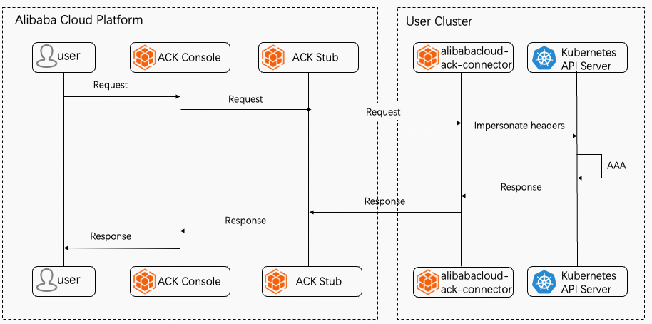

# AlibabaCloud ACK Connector

AlibabaCloud ACK Connector is a client-side agent that connects any Kubernetes cluster to ACK.

## How it works

AlibabaCloud ACK Connector runs in Kubernetes as a Deployment, the request from ACK to Kubernetes is like below:

## Development

`mkdir -p $GOPATH/github.com/alibaba && cd $GOPATH/github.com/alibaba`

`git clone https://github.com/alibaba/alibabacloud-ack-connector`

`cd alibabacloud-ack-connector && go mod tidy`

`make docker-build`

## Contact us

You can join the DingDing Talking (GroupID: 35688562) to talk with us.

## License

This project is licensed under the Apache-2.0 License.
